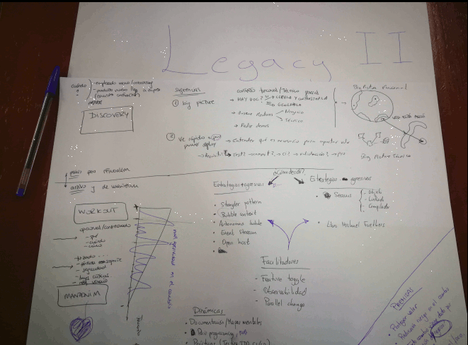

# Legacy II
a.k.a Irune y los 3 franketeros

+ **Francisco Javier**, @fgperianez
    + dev, QA; Nextail, ingesta y gestión de datos
    + Experiencia [Tirar el legacy que yo mismo construí cuando la startup tenía que salir adelante](https://ftt.programania.net/2019/experiencia/317124317462000)

+ **Francisco Ortiz**, @fortiz2305
    + dev, xp/devops; Nextail
    + Experiencia [Observar antes de empezar a cambiar](https://ftt.programania.net/2019/experiencia/1554977395000)

+ **Fran Reyes**, @fran_reyes
    + dev, consultoría, formación, mentoring, producto/estrategia y cualquier cosa para mejorar el delivery; Codesai
    + Experiencia [Legacy de mis amores](https://ftt.programania.net/2019/experiencia/1552897702000)

+ **Irune**, @wideawakening
    + dev/devops, #dirtylittlethings lover; WIP
    + Experiencia [Antinieblas](https://ftt.programania.net/2019/experiencia/1549712701000)

+ **Asier**, @uthopiko
    + ClassMemberNotFound :(
    + Experiencia: [Lidiar con las grandes bolas de ....](https://ftt.programania.net/2019/experiencia/1552149157000)

___

## Puesta en común

Resumen construído con las increíbles técnicas de sketching de los integrantes (GIF)

### Qué es legacy

- desconocido en un porcentaje alto (modelos mentales perdidos)
- duro de cambiar
- requiere ser modificado

### Legacy Discovery

* **cuándo acometerlo**
    * onboarding; alguien nuevo necesita entender el contexto del código
    * cambio contractor; el código pasa de unas manos a otras (concursos públicos)

* **big-picture**
    * contexto funcional y técnico general
    * hay doc? si la hay, leerla y contrastarla, si no, generarla
    * mentor(es) de negocio y técnico
    * demos

* **vámonos a pro!**
    * realizar una tarea sencilla durante todo su ciclo
    * toma de requisito > dev > commit > ci > validación > pro
        * doc?
        * test?

### Legacy Workout / Maintenance

* Acometer los cambios sobre el legacy con **prioridad alta** si se dan
    * nuevos requisitos de usuario
    * bugs críticos
    * pérdida de soporte de librerías / frameworks / ...
    * fallos de seguridad

* sean de la prioridad que sean, siempre deben cumplir las siguientes **premisas**    
    * proteger el valor
    * reducir el riesgo en el cambio
    * acordado con/amparado por negocio

#### Estrategias para el cambio

* Determinar las **heurísticas** para la decisión de estrategia a seguir

* **Estrategias**
    * [Working effectively with Legacy Code, Michael C.Feathers](https://www.amazon.com/Working-Effectively-Legacy-Michael-Feathers/dp/0131177052)
    * \+ agresivas
        + Reescritura
        + [Monolith to microservices](https://martinfowler.com/articles/break-monolith-into-microservices.html)
        + [Strangler Pattern](https://www.michielrook.nl/2016/11/strangler-pattern-practice)        
        + [Bubble context](http://dddcommunity.org/library/evans_2011_2/2)
        + [Autonomous bubble](http://dddcommunity.org/library/evans_2011_2/3)
        + [Event stream](http://dddcommunity.org/library/evans_2011_2/5)
        + [Make Legacy Assets Accessible as Open Host Services in Published Language](http://dddcommunity.org/strategic-design/four-strategies-for-dealing-with-legacy-systems-strategy-3-make-legacy-assets-accessible-as-open-host-services-in-published-language-45/)
        
    * \- agresivas
        + [Seams, Sprout, Wrap...](https://www.oreilly.com/library/view/working-effectively-with/0131177052/)
   
* **Facilitadores**

    - Observabilidad
        - crear una foto antes de tocar nada para poder comparar a posteriori
        - [Opentracing.io](https://opentracing.io), [DataDogHQ](https://www.datadoghq.com/apm)
    - [Parallel change](https://martinfowler.com/bliki/ParallelChange.html)
    - [Feature toggle](https://martinfowler.com/articles/feature-toggles.html)

   
* **Dinámicas**
    - Documentación
        + Changelogs
        +  [Arquitecture Decision Record](https://github.com/joelparkerhenderson/architecture_decision_record)
        +  [Wardley Maps](https://miro.com/blog/wardley-maps-whiteboard-canvas/)
        +  [C4 Models](https://c4model.com)
        + [Matrices de competencia/conocimiento](https://ftt.programania.net/2018/experiencia/2018019)
    - Pair/Mob programming
    - Prácticas de testing, TDD, CI/CD
    - **Make legacy attractive ♥**

