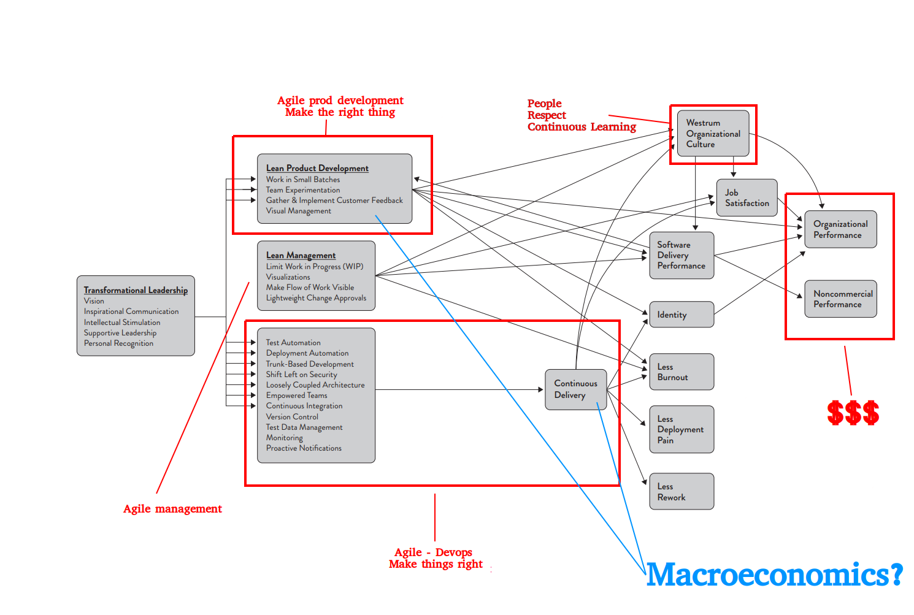
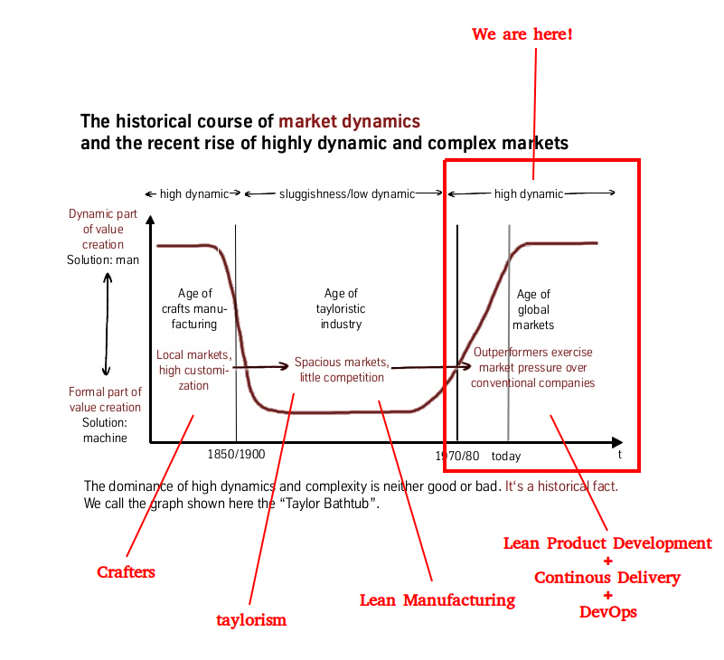
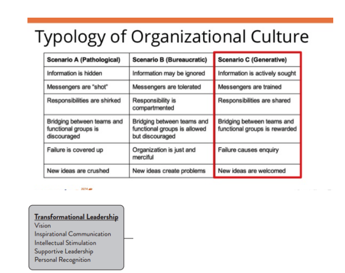

# Macro && Microeconomics

## Slides

<iframe src="https://docs.google.com/presentation/d/e/2PACX-1vSt0LXyndi2iAJS-0OwxoqVI5RF26XuPycSLeV7F44Im58b1ZRLQL5M3X5hH3L3Y6YwZwxmS8BL-W-r/embed?start=false&loop=false&delayms=3000" frameborder="0" width="960" height="569" allowfullscreen="true" mozallowfullscreen="true" webkitallowfullscreen="true"></iframe>

## Equipo

* [Abel Muiño](https://twitter.com/amuino)
* [Félix López](https://twitter.com/flopezluis)
* [Eduardo Ferro](https://twitter.com/eferro)
* [Luis Artola](https://twitter.com/artolamola)
* [Fran Mosteiro](https://twitter.com/fran_mosteiro)

## Conclusiones

### Punto de partida de la experiencia

Estoy quemado de discutir lo obvio.... Demuestrame que me equivoco =)
¿Se puede introducir a posteriori las practicas de ingenieria? ¿Cual es el coste? ¿Teniendo en cuenta la inercia, compensa posponer las más básicas?

### Notas

* Estamos en la quita revolución técnologica (Age of information and telecommunications o Agel of software & Digital).
* Parece que estamos en el “Turning point” (no sabemos cuanto va a durar).
* Sólo lideran los que controlen el medio de producción de esta era (software-prod digital).
* ¿Cual es el medio de producción?
    * Digital product development flow?
    * Software development flow?
    * Lean operations
* Respuesta DORA: 
    * Software delivery and Operational performance, or SDO performance
    * Métricas: Freq deployment, Lead time, MTTR, Failure rate
    * ¿Nos cuadra? ¿Es insuficiente? tiene sentido todo esto sin Lean Product Development? qué es más importante? La orientación a lean prod y outcomes, o al desarrollo de software ¿tienen sentido el uno sin el otro?

#### Asunciones:
* Tendencia hacia producto
* Actualmente los que tienen buen SDO tienen gran ventaja competitiva (experiencia Luis, Experiencia Felix…)
* Cuando pasemos al deployment period, si NO tienes buen SDO desapareceras y el SDO ya no será la gran ventaja competitiva.

### Puntos de discusión

* ¿Por qué perseguir outcomes y no outputs?
* ¿Cómo resolver la paradoja de que los mejores técnicos dejen de hacer cosas técnicas para tener más impacto?
* Si me muevo buscando impacto o eliminar cuello de botella parece inevitable alejarme del teclado y el barro… ¿no puedo maximizar el impacto desde el barro?
* ¿Decimos "cultura" cuando queremos decir "costumbres"?
* ¿Producto = equipo?
* ¿Cómo construímos cultura/costumbres?

* ¿Hay cosas que son microeconomics y otras macroeconomics? ¿O son las mismas cosas pero "a vista de pájaro"? 
No son lo mismo, pero tienen que ver... Macroeconomics aplicaría al flow general y la tendencia... Por ejemplo entrega continua sería parte de la macroeconomia, pero hacer o no tdd para esta parte del algoritmo es microeconomics...
Parking en un caso concreto son decisiones microeconomics, pero por defecto hacer pairing en las tareas de tipo A o B y no en las C, sería macroeconómico…

    * ¿Qué relación veis entre macroeconomics y lean? ¿Son lo mismo? ¿Complementario? ¿Contradictorio?
    Macroeconomics seria el sistema económico a nivel de toda la empresa de forma que decida la forma "por defecto" de actuar en cada uno de los contextos... Lean seria la base/principios para varios de estos sistemas... así que no son lo mismo, aunque parece que a nivel macroeconomico, para hacer y operar productos digitales los correspondientes sistemas derivados de lean parecen aplicar... (o por lo menos más que otros tayloristas...)

    

* ¿De la misma manera que hay microeconomics y macroeconomics hay microleans y macroleans?	

Parece que no tiene sentido macrolean, microlean... Pero si la aplicación de los mismos principios y usarlos en diferentes contextos, para diferentes objetivos y a diferentes niveles/escala.... Ya que lean son principios básicos [Los_principios_lean](https://es.wikipedia.org/wiki/Lean_software_development#Los_principios_lean) y luego hay aplicaciones a distintos procesos (lean manufacturing, lean software development, lean product development, etc)... y por supuesto,  se puede definir los sistemas de trabajo en una empresa basandose todos en los mismos principios... Eso además hace que todo sea coherente y compatible…

* ¿Puedo, como desarrollador, maximizar mi impacto en el producto "haciendo" microeconomics + lean, o sólo haciendo macroeconomics + lean?

Formulando la pregunta de otra manera: ¿la forma de maximizar mi impacto es dejar de programar?
No, la forma de maximizar el impacto es entender las macroeconomics y empujar ingenieria necesaria para que ese flujo funcione, mientras en el dia a dia uso mis principios lean y microeconomics para  tomar decisiones durante el proceso de desarrollo...
pero no valdra de nada hacer microeconomics si a nivel macro somos un waterfall de libro o no puedo mejorar el end2end o somos una software factory con entregas cada 6 meses…

* Si empiezo por la entrega continua sin, por ejemplo pruebas automatizado, soy un kamikaze. Si hago tdd pero a nivel macro se entrega cada seis meses, no tengo impacto. No macro sin micro, y micro es irrelevante si no hay macro. Todo parece depender de todo. ¿Por dónde empiezo? (¿O como priorizo?)

Si no despliegas bajo demanda, cuando quieres, tu bottleneck es ese, así que cambiar de escala de tiempo para los deploys debería ser la prioridad 1/año -> 4/año -> 1/2meses -> 1/mes -> 1/2semana -> 1/1 semana -> 2/1 semana -> etc... Suponemos que haciendo ese proceso vas requiriendo madurar en tu ingenieria... y suponemos que cuando estamos por 1/2semanas ya podremos empezar a plantearte ir ampliando el end2end... por ejemplo, preguntando, ¿estamos haciendo lo que tenemos que hacer? ¿medimos outcomes? ¿medimos outputs?
lo que esta claro es que incrementar esa frequencia mete presión en nuestro proceso de ingenieria
y ampliar el end2end en horizontal mete presión al proceso de producto... (para ampliar en horizontal tenemos que meter cosas como operarlo nosotros, que esté medido el uso, que llegue al usuario final, que se haga product discovery, que se entregue funcionalidad de forma progresiva)
Vamos, que el ciclo es definir visión final, y meter presión  (freq despliegue, métricas de uso producto, etc), identificar el bottleneck y atacarlo... y vuelta a empezar...
Pero si como equipo no usas un mínimo de prácticas como para hacer integración continua (la práctica XP, no el invento que se ha entendido) y deployment bajo demanda, el equipo de ingeniería no es suficientemente maduro...  así que a nivel de empresa, eso es algo a resolver (excepto que haya incluso algo más dramático).

* O sea: empezar con continuous delivery. Práctica no apta para novatos (requiere elevar el nivel técnico). Si tenemos un equipo de solo novatos.... ¿No hay esperanza? ¿Qué hacemos?

* ¿Cómo hacer que CD eleven el nivel de los técnicos, en lugar de destrozarlos y que sean arrasados por la marea?

Contexto sistema legacy, quizás pasar de 1 entrega al año a ir mes a mes, nos puede durar un año o más... pero la otra opción es soltar el volante y dejarse llevar mientras el resto del mundo te adelante y los desarrolladores se van...
si es un producto nuevo o una parte nueva... muchas veces, más que hace, se puede comprar/alquilar mucha base... por ejemplo si es cloud...
creo que muchas veces no valoramos una de las mejores ventajas del cloud o de un paas... *nos empuja a usar ciertas prácticas*
Eso si, si no tenemos el mindset de agilidad, las iniciativas centradas en lo técnico son complicadas... Cada vez estoy más convencido de que el problema es el *legacy mindset* no las *aplicaciones legacy* (que son las que nos dan de comer).

* ¿Qué es eso de la "mentalidad" o la "cultura"? .... ¿No son simplemente costumbres?
Lo que haces de forma habitual... tus habitos y constumbres... y los que toleras... A la hora de identificar la cultura organizacional, DORA usa la "Westrum Organizational Culture" e indica que para empujar estos cambios se require Transformational Leadership

Desde luego uno de sus cometidos es ir comiendo la oreja y cambiando los hábitos... para introducir el learning continuo... el blameless... teoría de colas y constrains... e ir ayudando a mejorar el nivel de madurez ingenieril... y eso me vuelve al principio... para saber como mejorar hay que saber a dónde ir, y esa es la pregunta original... cual es la visión final? la de accelerate nos cuadra? ¿deberíamos considerarlo una referencia y dedicar la energía al camino y a la adaptación al contexto?

* ¿Sabes que me pasa a mí en mi contexto? 

Qué la visión del accelerate o de cualquier otro libro de se estilo me vale: porque pone tantas cosas que NO voy a poder abordar en mi empresa ni en 8 vidas que me sirve para buscar el top 5 cosas que sí están entre las que puedo cambiar y más impacto podrían provocar ... Pero una vez que he repasado lo que pone, tengo para un año de trabajo con los 5 puntos que haya elegido #miContexto Me pasó lo mismo con el Leading Lean: ofrece 24(!!) ópticas desde las que analizar la situación (en busca de la mejora, etc) Con mirar 3 de las 24 ya tengo trabajo hasta el día de.mi muerte..... :-P Respecto a si me valen esas ópticas ... ¡Claro! Casi cualquier modelo me es útil para darme una visión de que sería lo cojonudo y trazar un plan entre mi maldita realidad y esa proyección al champán...
La diferencia en este caso, es que Accelerate parece el estudio más completo que hemos hecho hasta la fecha en nuestra profesión... por otro lado a mi me aportaría tener un camino más trazado y poder dedicar mi energía sin entrar en ciertas discusiones que solemos tener en nuestra profesión (merece la pena la entrega continua o no?, el testing automático es opcional? la calidad es economicamente rentable? tiene sentido hacer outsourcing?, etc...)...

En cuanto a tiempos...
Los cambios de dirección o de cultura requieren años...
Así que lo importante es la tendencia y la dirección…

* ¿Y si no haces producto propio/interno? Y si tu tamaño de empresa y modelo de negocio dan vueltas alrededor del margen? Cómo inviertes en mejorar tu delivery, si tu subsistencia depende de "salir pronto", si, pero con "todo" y a precio muy bajo. Lo que impacta directamente en la cultura y mindset de tu empresa, que hasta contrata personas que "se puede permitir".
Ahogado en tu propio círculo vicioso.
Es decir, tiene sentido macroecon. microeco en un entorno de NO producto propio ?
Si no te adoptas a ello, mueres?

* ¿Y qué pasa cuando tu bottleneck ya no es "desplegar bajo demanda"?
Nosotros podemos desplegar bajo demanda, incluso tenemos proyectos que se despliegan con cada push a GIt en PRe ..... pero sin test's, sin posibilidad de rollback, .... y lo vemos como lo normal! ¿Cómo vendes que lo que necesitas ahora es invertir en microeconomics de ese estilo? ¡Si despliegas de forma continua y peta pocas veces! =/
Y luego claro, como demuestras o implementas lo macro, cuando tu foco está en la venta comercial y el margen =O Incluso en producto propio

* Si tu core de negocio es alrededor de un producto de software, incluso si son servicios de software, ¿son necesarios los perfiles de manager de técnic@s? ¿Hasta qué “profundidad”? (tech leads, eng. Managers, …)

## Conclusiones
* [Macro vs micro](https://docs.google.com/presentation/d/1Xsu2NBV6mQw0krdJ97gnm1SOPCPTaSZzITjgjLNgcD0/edit?usp=sharing)

## Enlaces de interés

* [State of DevOps](https://cloudplatformonline.com/2018-state-of-devops.html)
* [Agile manifesto](https://agilemanifesto.org/iso/es/principles.html)
* [Continuous delivery](https://continuousdelivery.com/)
* [Feature toggles](https://martinfowler.com/articles/feature-toggles.html)
* [The Surprising Secret to Being a Good Boss](https://www.youtube.com/watch?v=4yODalLQ2lM)
* [Books that every engineering manager should read](https://medium.freecodecamp.org/books-that-every-engineering-manager-should-read-7a053e296d11)
* [How to become a great engineering manager](https://devops.com/how-to-become-a-great-engineering-manager/)
* [How to become the eng. manager your company needs?](https://www.codementor.io/blog/how-to-be-the-engineering-manager-your-company-needs-1yahjbf97x)
* [How to fail as a new engineering manager?](https://blog.usejournal.com/how-to-fail-as-a-new-engineering-manager-30b5fb617a)
* [30 resources to help your developer teams grow](https://techbeacon.com/app-dev-testing/engineering-managers-guide-30-resources-leading-developers)
* [Circle CI, about hiring managers](https://circleci.com/blog/what-we-ve-learned-about-hiring-engineering-managers/)
* [Eng. manager 101](http://theengineeringmanager.com/management-101/)
* [eXtreme programming: why and how](https://medium.com/the-thinking-persons-book-reviews/what-is-extreme-programming-and-how-do-you-do-it-7895ff4938dc)

## Libros recomendados

* [The manager's path](https://www.amazon.co.uk/Manager%60s-Path-Camille-Fournier/dp/1491973897)
* [Programming beyondb practices](https://www.amazon.es/Programming-Beyond-Practices-More-Monkey-ebook/dp/B01LYRCGA8/ref=sr_1_fkmrnull_1?__mk_es_ES=%C3%85M%C3%85%C5%BD%C3%95%C3%91&keywords=more+than+a+code+monkey&qid=1555156240&s=gateway&sr=8-1-fkmrnull)
* [First 90 days strategies](https://www.amazon.com/First-90-Days-Strategies-Expanded/dp/1422188612)
